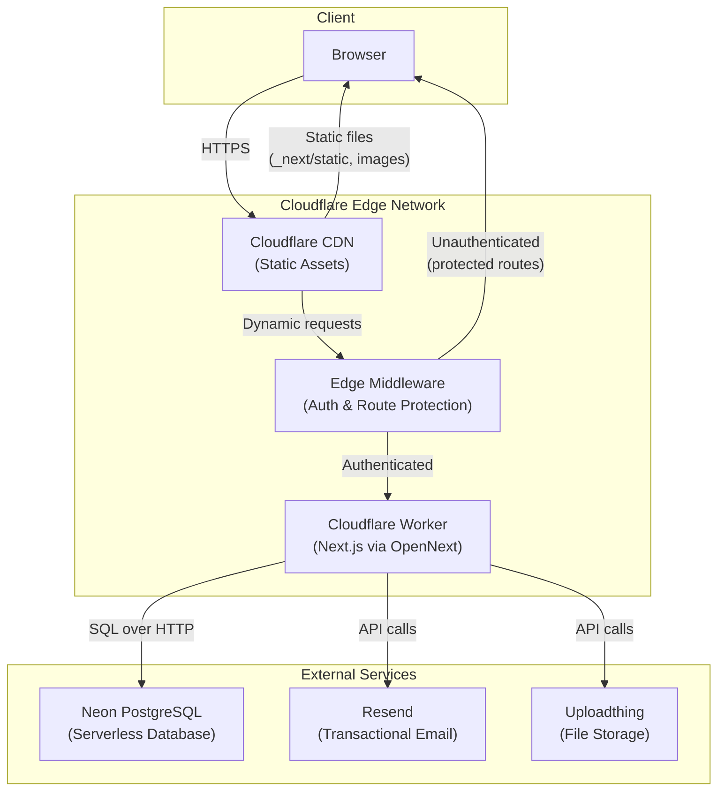
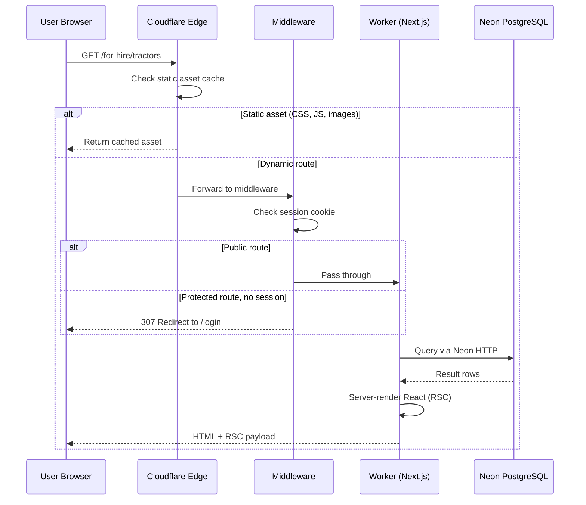
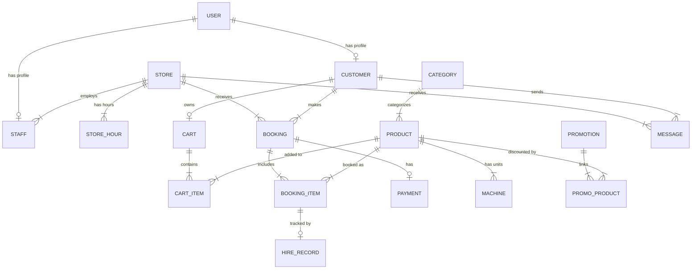
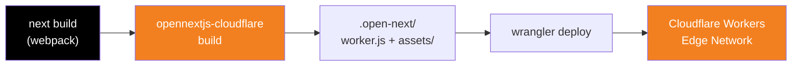

<div align="center">

# AgriHire Solutions

### Modern Agricultural Equipment Hire Management System

A full-stack equipment rental platform for New Zealand agricultural businesses, built with Next.js 16, Neon PostgreSQL, Better Auth, and shadcn/ui. Features multi-store operations, tiered pricing, role-based access control, and real-time analytics dashboards.

Deployed on Cloudflare Workers via the [OpenNext](https://opennext.js.org/) adapter.

[](https://agrihire.chanmeng.org)


</div>

---

## Architecture



## Request Flow



---

## Features

### Public Storefront
- **Equipment Browsing** — Browse by category, search, view detailed specs and tiered pricing
- **Store Locator** — Find nearest stores with addresses and contact info
- **Promotions** — Active discount codes with linked products
- **News** — Store announcements and articles
- **Contact** — Message submission to specific stores

### Customer Portal
- **Shopping Cart** — Add equipment with hire dates, apply promo codes, quantity management
- **Booking System** — Review and submit bookings with store selection (transactional processing)
- **My Bookings** — View booking history, item details, hire status, payment receipts
- **Messages** — Two-way messaging with store staff
- **Profile** — Update personal info, address, and change password

### Staff Dashboard
- **Analytics** — Revenue charts, category distribution, stats cards (Recharts)
- **Booking Management** — View all bookings with customer details and hire records
- **Checkout/Return** — Equipment check-out and return workflow with staff tracking
- **Equipment Management** — Machine inventory with serial numbers, service records
- **Product Management** — CRUD for products with 3-tier pricing
- **Category Management** — Inline add/edit with status toggle
- **Inventory Overview** — Stock summary by product (available/hired/inactive counts)
- **Promotions** — Create and manage discount promotions with linked products
- **News** — Publish and edit store articles
- **Messages** — Reply to customer messages with notification tracking

### Admin Panel
- **Store Management** — Create stores with auto-generated operating hours
- **Staff Management** — Create staff accounts with role assignment
- **Customer Management** — View all customers with booking counts and status

### Infrastructure
- **Authentication** — Email/password with 5-role RBAC (customer, staff, lmgr, nmgr, admin)
- **Dark Mode** — System-aware theme with manual toggle
- **Responsive** — Mobile sidebar navigation for dashboard
- **Loading States** — Skeleton UIs for all route groups
- **Error Handling** — Custom 404, 500, and 403 pages
- **Email** — Password reset and booking confirmation emails via Resend
- **File Uploads** — Uploadthing integration for product/machine images

---

## Tech Stack

| Layer | Technology |
|-------|-----------|
| **Framework** | [Next.js 16](https://nextjs.org/) (App Router, Server Components, Server Actions) |
| **Language** | [TypeScript 5](https://www.typescriptlang.org/) |
| **UI** | [shadcn/ui](https://ui.shadcn.com/) + [Tailwind CSS 4](https://tailwindcss.com/) |
| **Database** | [Neon](https://neon.tech/) (Serverless PostgreSQL) |
| **ORM** | [Drizzle ORM](https://orm.drizzle.team/) |
| **Auth** | [Better Auth](https://better-auth.com/) |
| **Charts** | [Recharts](https://recharts.org/) |
| **Email** | [Resend](https://resend.com/) |
| **Uploads** | [Uploadthing](https://uploadthing.com/) |
| **Icons** | [Lucide React](https://lucide.dev/) |
| **Deployment** | [Cloudflare Workers](https://workers.cloudflare.com/) via [@opennextjs/cloudflare](https://opennext.js.org/cloudflare) |

---

## Project Structure

```
src/
├── app/
│   ├── (auth)/              # Login, Register, Reset Password (4 pages)
│   ├── (public)/            # Equipment, Stores, News, Promotions, Contact (9 pages)
│   ├── (customer)/          # Cart, Bookings, Messages, Profile (6 pages)
│   ├── (dashboard)/         # Staff dashboard & admin panel (26 pages)
│   ├── api/                 # Auth, Cart count, Uploadthing routes
│   ├── page.tsx             # Data-driven homepage
│   ├── not-found.tsx        # 404 page
│   └── error.tsx            # Error boundary
├── components/
│   ├── ui/                  # shadcn/ui components
│   ├── layout/              # Header, Footer
│   ├── dashboard/           # Sidebar, Mobile nav, Charts, Stats
│   └── equipment/           # Hire form
├── lib/                     # DB, Auth, Email, User context utilities
├── middleware.ts             # Route protection & auth redirection
└── server/
    ├── actions/             # 8 server action modules
    └── queries/             # 9 data query modules

drizzle/
├── schema.ts               # 20 PostgreSQL table definitions
├── relations.ts             # Entity relationships
└── seed.ts                  # Sample data seeding script

# Cloudflare Workers config
wrangler.jsonc               # Worker name, compatibility flags, env vars
open-next.config.ts          # OpenNext adapter configuration
```

---

## Database Schema



20 tables organized into domains:

| Domain | Tables |
|--------|--------|
| **Auth & Users** | `user`, `customer`, `staff`, `reset_tokens` |
| **Stores** | `store`, `store_hour` |
| **Catalog** | `category`, `product`, `machine`, `service` |
| **Bookings** | `booking`, `booking_item`, `hire_record`, `payment` |
| **Cart** | `cart`, `cart_item` |
| **Promotions** | `promotion`, `promo_product` |
| **Communication** | `message`, `notifications`, `news` |
| **System** | `setting` |

---

## Getting Started

### Prerequisites

- Node.js >= 18
- A [Neon](https://neon.tech/) database
- (Optional) [Resend](https://resend.com/) API key for emails
- (Optional) [Uploadthing](https://uploadthing.com/) token for file uploads

### Installation

```bash
# Clone the repository
git clone https://github.com/ChanMeng666/agrihire-solutions.git
cd agrihire-solutions

# Install dependencies
npm install

# Copy environment variables
cp .env.example .env.local
# Edit .env.local with your Neon DATABASE_URL and other values

# Push database schema to Neon
npm run db:push

# Seed sample data
npm run db:seed

# Start development server
npm run dev
```

Open [http://localhost:3000](http://localhost:3000) to view the app.

### Available Scripts

| Command | Description |
|---------|-------------|
| `npm run dev` | Start Next.js development server |
| `npm run build` | Build Next.js for production (webpack) |
| `npm run build:worker` | Build Cloudflare Worker via OpenNext |
| `npm run start` | Start local production server |
| `npm run preview` | Preview Worker build locally (Wrangler dev) |
| `npm run deploy` | Deploy to Cloudflare Workers |
| `npm run lint` | Run ESLint |
| `npm run db:push` | Push Drizzle schema to database |
| `npm run db:generate` | Generate migration files |
| `npm run db:seed` | Seed database with sample data |
| `npm run db:studio` | Open Drizzle Studio |

---

## Deployment

The application is deployed on **Cloudflare Workers** using the `@opennextjs/cloudflare` adapter, which converts the Next.js output into a Worker-compatible bundle.



### Deploy to Cloudflare Workers

```bash
# 1. Install dependencies
npm install

# 2. Set secrets (one-time)
npx wrangler secret put DATABASE_URL
npx wrangler secret put BETTER_AUTH_SECRET
npx wrangler secret put RESEND_API_KEY
npx wrangler secret put UPLOADTHING_TOKEN

# 3. Update wrangler.jsonc with your account_id and domain URLs

# 4. Build & deploy
NEXT_PUBLIC_APP_URL=https://your-domain.com npm run build:worker
npm run deploy
```

### Key Configuration Files

| File | Purpose |
|------|---------|
| `wrangler.jsonc` | Cloudflare Worker config (name, account, compatibility flags, env vars) |
| `open-next.config.ts` | OpenNext adapter configuration |
| `next.config.ts` | Next.js framework configuration |
| `drizzle.config.ts` | Drizzle ORM database configuration |

### Environment Variables

| Variable | Type | Description |
|----------|------|-------------|
| `DATABASE_URL` | Secret | Neon PostgreSQL connection string |
| `BETTER_AUTH_SECRET` | Secret | Auth encryption key (min 32 chars) |
| `RESEND_API_KEY` | Secret | Resend email service API key |
| `UPLOADTHING_TOKEN` | Secret | Uploadthing file upload token |
| `BETTER_AUTH_URL` | Var | Production URL (e.g. `https://agrihire.chanmeng.org`) |
| `NEXT_PUBLIC_APP_URL` | Var | Public app URL (baked at build time) |

### Important Notes

- The build uses `--webpack` flag (not Turbopack) for Cloudflare Workers compatibility
- `nodejs_compat` compatibility flag is enabled in `wrangler.jsonc` for Node.js `crypto` module support
- `NEXT_PUBLIC_APP_URL` must be set as an environment variable during `npm run build:worker` since Next.js inlines it at build time

---

## Sample Accounts

After running `npm run db:seed`, these accounts are available:

| Role | Email | Notes |
|------|-------|-------|
| Customer | cust1@email.com | Auckland store |
| Customer | cust2@email.com | Christchurch store |
| Staff | staff1@agrihire.nz | Auckland store |
| Local Manager | lmanager1@agrihire.nz | Auckland store |
| Network Manager | nmanager1@agrihire.nz | All stores |
| Admin | admin1@agrihire.nz | Full access |

> **Note:** These seed accounts use bcrypt-hashed passwords from the original system. For new accounts, use the registration form.

---

## License

This project is for educational and demonstration purposes.

---

<!-- CHAN MENG PERSONAL BRAND -->
<div align="center">
  <a href="https://github.com/ChanMeng666" target="_blank">
    
  </a>

  <p><strong>Chan Meng</strong><br/>Need a custom app like this one? I build them — let's talk.</p>

  <a href="mailto:chanmeng.dev@gmail.com"></a>
  <a href="https://github.com/ChanMeng666"></a>
</div>
<!-- /CHAN MENG PERSONAL BRAND -->
